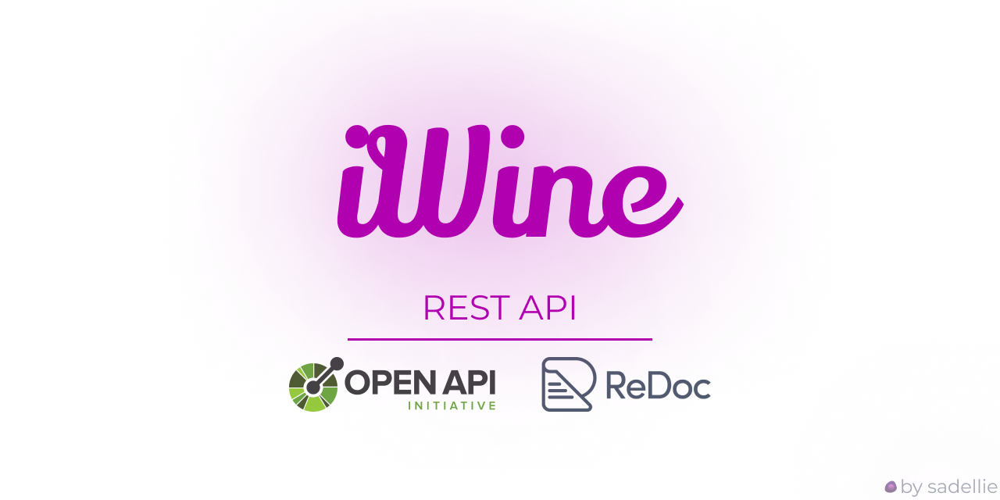

# OpenAPI portfolio project


This is just a simple portfolio project for a "smart" decanter for wine. *Not a real product, use your* 🌈*imagination*🌈.

# How to build
```sh
redoc-cli build iwine.yaml -t template.html -o index.html
```

# How to serve
```sh
redoc-cli serve iwine.yaml -t template.html
```

# Contribute
Why?
